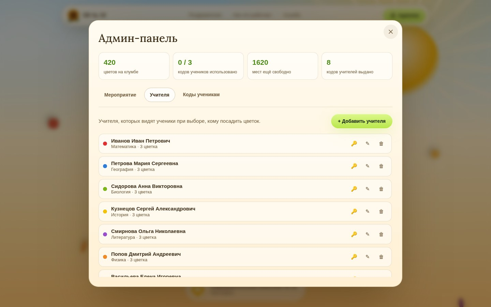

# Клумба для учителей

Интерактивный сайт ко Дню учителя для Образовательного комплекса № 10 (Ярославль):
каждый ученик сажает один цветок по одноразовому коду, все цветы растут на общей клумбе.

**Сделано (этапы 1–5 + доработки):** архитектура, схема базы и безопасность (SQL), главная страница в ярком
солнечном стиле с анимированным солнцем, живая клумба на Canvas с анимацией посадки, вход по личному коду
(ученик/учитель/админ), выбор цвета и места на клумбе учеником, открытка с личным пожеланием для каждого
учителя, пожелание на учебный год для вошедших учеников и обширная админ-панель (запуск/остановка посадки,
учителя, коды). Клумба пока работает на демо-данных, без Supabase.
Подробности — в [docs/ARCHITECTURE.md](docs/ARCHITECTURE.md).

### Вход администратора

В этом демо-предпросмотре админ входит через ту же форму «Вход по коду», но вместо 10-значного кода
вводит **слово** (сейчас — `ПОДСОЛНУХ`, задано в `lib/api/demo.ts` → `DEMO_ADMIN_WORD`). Оно сразу
открывает админ-панель: остановить/открыть посадку, добавить, изменить или удалить учителя (с
пожеланием для открытки и набором доступных цветов), получить код входа для учителя, сгенерировать
коды ученикам и выгрузить все коды в CSV — всё это пока работает на демо-данных в памяти браузера.

Это нарочно **только для предпросмотра**: слово лежит открытым текстом в коде, который получает
браузер, — так вход администратора устраивать нельзя. На настоящем сайте админ должен входить через
Supabase Auth (email + пароль) — это уже заложено в `supabase/migrations/0002_security.sql`
(`public.admins` + `is_admin()`), см. шаг «Администратор» ниже. На этапе подключения Supabase
методы `admin*` в `lib/api` (сейчас — `lib/api/demo.ts`) нужно будет переписать так, чтобы они
звали SQL-функции только после такого входа, а не проверяли секретное слово на клиенте.




## Запуск локально

Нужен Node.js 20+.

```bash
npm install
npm run dev
```

Откройте http://localhost:3000. Кнопка «Посадить пробный цветок» внизу показывает анимацию роста и подсветку нового цветка.

## Шаг 0 — проверка доступности из России (сделайте до всего остального)

1. Зарегистрируйтесь на supabase.com и создайте проект (регион — ближайший к вам, например Frankfurt).
2. Откройте в браузере `https://<ID-проекта>.supabase.co/auth/v1/health` с телефонов на **МТС, МегаФон, Билайн, Т2** (мобильный интернет, не Wi-Fi) и в школьной сети.
3. Любой ответ (даже сообщение об ошибке про apikey) — связь есть. Если страница долго «крутится» и не открывается — Supabase недоступен для части учеников, напишите мне, перейдём на запасной вариант.

## База данных (этапы 2–3)

Supabase → SQL Editor → New query. По очереди вставьте и выполните файлы из `supabase/migrations/`:
`0001_schema.sql`, `0002_security.sql`, `0003_functions.sql`, `0004_seed.sql`.
Для пробы можно добавить `demo_teachers.sql` — восемь демо-учителей с готовыми пожеланиями для открытки.
Файлы проверялись только чтением: базы Postgres в среде разработки не было, поэтому при первом запуске
сообщите мне текст ошибки, если она появится.

Коды создаются в админке (этап 8): `admin_generate_codes(количество, класс, 'student')` — коды на посадку,
по одному на ученика; `admin_generate_codes(1, null, 'teacher', id_учителя)` — личный код учителя для входа
и открытия открытки. Один и тот же ученический код даёт посадить только один цветок; учительский код можно
вводить сколько угодно раз.

Администратор: Authentication → Users → Add user (email + пароль), затем в SQL Editor:

```sql
insert into public.admins (user_id) select id from auth.users where email = 'ВАШ@EMAIL';
```

Затем отключите публичную регистрацию: Authentication → Sign In / Providers → выключить «Allow new users to sign up».

## Что заменить своим

* `public/hero/autumn-card.jpg` — на открытке заметен мелкий водяной знак стокового сайта, лучше взять версию без него (и в большем разрешении: сейчас 736 px).
* Фон первого экрана сейчас нарисован CSS. Если есть макро-фото мха, положите его в `public/hero/moss.jpg` и подключите в `.hero__moss` (`styles/site.css`).
* Тексты по умолчанию: `lib/content.ts` (позже они переедут в админку).
