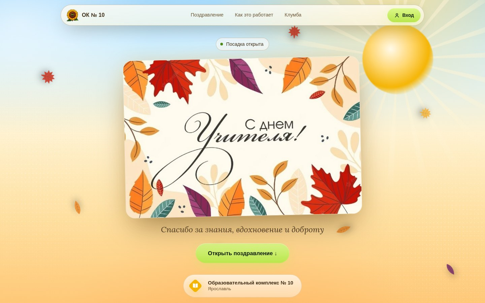

# Клумба для учителей

Интерактивный сайт ко Дню учителя для Образовательного комплекса № 10 (Ярославль).
Каждый ученик по одноразовому коду сажает цветок для своего учителя, и все цветы растут на общей клумбе.



## Что умеет сайт

* **Живая клумба** на Canvas. Новые цветы у всех появляются сами, раз в несколько секунд, без перезагрузки.
  При наведении (или касании) видно имя учителя, предмет и цветок.
* **Подсолнух в центре клумбы принадлежит директору — Дмитриевой Любови Валентиновне.**
  У неё свой вход: кнопка «Вход для директора школы» в разделе «Как это работает» или обычный «Вход» с её личным кодом.
  После входа открывается золотая открытка с персональным поздравлением. Текст меняется в админке.
* **Ученик** входит по коду, выбирает учителя, один из 9 цветов (тюльпан, роза, мак, ромашка, василёк,
  подсолнух, астра, хризантема, колокольчик), цвет и место на клумбе. После посадки сайт его благодарит.
  Один код — один цветок.
* **Учитель** входит по своему коду и открывает открытку с личным пожеланием, может показать на клумбе только свои цветы.
* **Админ-панель** (вход — пароль администратора в том же окне «Вход»):
  * запуск и остановка посадки, текст финального экрана;
  * учителя: добавить, изменить (пожелание, какие цветы доступны) или удалить. **При удалении учителя его цветы исчезают с клумбы**,
    а коды учеников, которые их посадили, снова становятся свободными. Директора удалить нельзя, изменить можно;
  * коды учеников пачками по классам, карточки для печати с QR, выгрузка всех кодов в CSV (открывается в Excel);
  * **QR-код сайта**: картинка PNG и плакат A4 для печати.
* **Режим для большого экрана** (адрес сайта с `?screen`, кнопка — в админке, раздел «QR-код сайта»): для проектора
  в актовом зале или телевизора в холле. Клумба во весь экран, крупный счётчик, QR-код «Посади свой цветок»,
  объявление о каждом новом цветке — камера сама показывает его крупно и возвращается ко всей клумбе.
* **QR-коды.** На карточке ученика или учителя QR ведёт на ссылку вида `https://сайт/?code=XXXXX-XXXXX`:
  телефон открывает сайт и сразу входит с этим кодом, ничего набирать не нужно. Код тут же убирается из адресной строки.

## Как устроено

* Next.js 15 (React 19). Сервер — это сам сайт (`app/api/[action]/route.ts`), отдельная база не нужна.
* Все данные (учителя, коды, посадки) лежат в одном файле `data/klumba.json`.
  Файл пишется атомарно, раз в 10 минут делается копия `klumba.backup.json`.
  Для одной школы (до ~2000 цветов и сотни человек одновременно) этого с большим запасом хватает.
* Правила (один код — один цветок, занятое место не выбрать, проверка выбора) описаны в одном месте, `lib/core/engine.ts`.
  Ими пользуются и сервер, и демо-режим.
* Защита: пароль администратора хранится только на сервере, браузер получает подписанный ключ сессии на 14 дней.
  Число неверных вводов кода с одного адреса ограничено: 60 за 10 минут, для пароля — 10 за 15 минут.
  Коды — 10 знаков из 20 непутающихся символов, около 10¹³ вариантов.

Подробнее — в [docs/ARCHITECTURE.md](docs/ARCHITECTURE.md).

## Запуск на своём компьютере

Нужен Node.js 20+ (лучше 22).

```bash
npm install
npm run dev
```

Откройте http://localhost:3000. Пароль администратора в режиме разработки — `ПОДСОЛНУХ`.
Чтобы сразу увидеть клумбу с демо-учителями и цветами, запустите `SEED_DEMO=1 npm run dev` на чистой папке `data/`.

## Размещение в интернете (хостинг)

Сайту нужен **сервер с постоянным диском**: там хранятся коды и посадки. Подходит любой VPS или облачное приложение
с Docker, например Timeweb Cloud, Selectel, Yandex Cloud или Beget VPS. Серверы в России быстрее открываются у учеников
на мобильном интернете. Vercel и подобные «бессерверные» хостинги **не подходят**: у них нет постоянного диска.

### Вариант 1. VPS с Docker (рекомендую)

1. Купите самый простой VPS (1 ядро, 1 ГБ памяти хватит) с Ubuntu и установите Docker.
2. Скопируйте проект на сервер (`git clone …`) и создайте в папке файл `.env`:
   ```
   ADMIN_PASSWORD=придумайте-длинный-пароль
   NEXT_PUBLIC_SITE_URL=https://ваш-домен.ru
   ```
3. Запустите: `docker compose up -d --build`. Сайт откроется на порту 3000. Данные хранятся в томе `klumba-data`
   и не пропадают при перезапуске и обновлении.
4. Для домена и https поставьте перед сайтом Caddy или nginx. С Caddy это одна строка в `Caddyfile`:
   `ваш-домен.ru { reverse_proxy localhost:3000 }`. Сертификат он получит сам.

### Вариант 2. Облачное приложение из Dockerfile

В панели хостинга создайте приложение из репозитория (сборка по `Dockerfile`), подключите постоянный диск
в папку `/data` и задайте переменные `ADMIN_PASSWORD` и `NEXT_PUBLIC_SITE_URL`.

### После размещения

1. Откройте сайт, нажмите «Вход» и введите пароль администратора.
2. «Учителя» → добавьте учителей. Директор уже есть, для неё впишите или поправьте пожелание.
   У каждого 🔑 выдаёт личный код входа (и карточку с QR). Код показывается один раз.
   Выдать новый можно в любой момент, старый при этом перестанет работать.
3. «Коды ученикам» → выпустите коды по классам → «Распечатать карточки с QR» → разрежьте и раздайте.
4. «QR-код сайта» → скачайте PNG или распечатайте плакат.
5. «Мероприятие» → «Идёт посадка».

Резервная копия — просто скопируйте файл `klumba.json` из тома `/data`
(`docker compose cp klumba:/data/klumba.json ./`).

## Демо без сервера

`npm run build && npm run preview:build` собирает в `preview-dist/` статическую версию в демо-режиме:
данные живут в памяти браузера, коды для проверки показаны прямо в окне «Вход», пароль администратора — `ПОДСОЛНУХ`.
Любую версию сайта можно открыть в демо-режиме, добавив `?demo` к адресу.

## Проверка

* `npm run typecheck` — типы.
* `npm run test:e2e` — сквозная проверка в браузере (25 сценариев: самолёт, подсказки, вход учителя, директора,
  ученика и админа, посадка, благодарность, удаление учителя с цветами, QR). Нужен Playwright (`npm i -D playwright`)
  и запущенный с демо-данными сайт:
  ```bash
  npm run build
  SEED_DEMO=1 DATA_DIR=/tmp/klumba-test ADMIN_PASSWORD=Подсолнух2026 npx next start -p 3005
  BASE=http://localhost:3005 PW=Подсолнух2026 npm run test:e2e
  ```

## Что можно заменить своим

* `public/hero/autumn-card.jpg` — на открытке заметен мелкий водяной знак стокового сайта, лучше взять версию без него.
* `public/brand/plane.webp` — самолёт с пилотом над клумбой (вырезан из присланной картинки). Флаг с надписью
  «С Днём учителя!» нарисован кодом и колышется на ветру: `components/garden/GardenBackdrop.tsx`.
* Тексты по умолчанию: `lib/content.ts`, поздравление директора по умолчанию — `lib/core/state.ts`.
